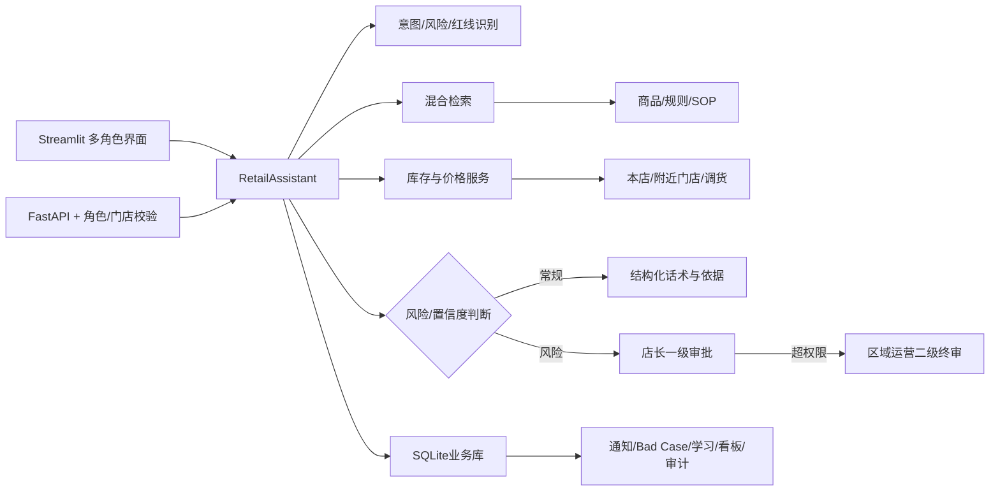

# 门店智伴 Retail Floor Copilot

门店智伴是一套面向服装连锁门店的内部AI知识、销售辅助与运营管理系统。产品覆盖导购即时查询、扫码与语音、实时库存与调货、顾客需求匹配、连带推荐、活动算价、门店规则、高风险审批、Bad Case治理、新品建档、淡场学习、区域运营与数据分析。

## 产品角色

| 角色 | 权限范围 |
|---|---|
| 导购 | 使用问答、扫码、语音、库存、商品卡、顾客匹配、连带推荐、快捷算价、规则和淡场学习；仅查看自己的问答与审批结果 |
| 店长 | 查看本门店问答、工单、Bad Case、新品申请和数据；执行一级审批、门店问题闭环与知识优化申请 |
| 区域运营 | 查看区域内全部门店；执行二级终审、跨店工单分配、商品/规则/推荐维护、知识优化、区域分析和审计 |

## 导购端

- 旺场简洁模式：只保留语音/文字输入、顾客话术与禁语提醒
- 商品编码、吊牌条码、商品名称、别名、拼音首字母查询
- 摄像头扫码与中文语音提问
- 最近5条查询快捷复用、常见问题快捷触发
- 商品话术、尺码、库存优先展示；面料与搭配折叠查看
- 本店分尺码库存、附近门店库存、调货时效、价格参考
- 顾客标签按身形、场景、风格、人群分组匹配
- 商品推荐按匹配度与库存排序
- 连带推荐展示业务理由、库存、调货口径，并可一键加入算价
- 快捷算价自动加载当前生效活动，拆解优惠明细并提供凑单建议
- 规则更新提醒、关键词高亮、风险标签与版本差异对比
- 淡场每日知识练习与个人成长记录

## 管理闭环

### 高风险问题确认

- 高/中/低风险待办数量
- 高风险优先、升级工单优先、2小时加急、24小时超时置顶
- 完整上下文：导购、门店、提交时间、AI结论、标准话术、风险依据、规则来源
- 待处理、处理中、已完成、已驳回状态筛选
- 确认回复、修改后回复、转线下处理、店长升级区域运营
- 全选当前页、全选高风险、批量模板、二次确认与批量分派
- 处理结果自动同步导购通知和原问答记录

### Bad Case闭环

- 高风险问题自动进入风险与知识复盘池
- 待处理、处理中、已优化、已关闭状态流转
- 知识库缺失、答案错误、边界模糊、话术不准、来源不匹配、规则过期、诱导违规、系统错误分类
- 责任人、处理时限、超时提醒、图片凭证
- 原问题、AI原回答、导购反馈、处理动作、关联规则/商品、版本与复测记录
- 同类问题聚合、优化后同类型问题重复统计
- 店长提交知识优化申请，区域运营分配和闭环处理

### 区域运营

- 跨门店工单终审和批量分派
- 商品知识卡编辑、批量维护与新品审核发布
- 固定推荐规则和动态标签推荐维护
- 规则统一发布、版本管理、已读提醒与差异对比
- 区域Bad Case分配、知识优化与效果追踪
- 门店综合得分、活跃度、知识覆盖、高风险、算价和连带推荐使用分析
- 所有审批、发布、修改、处理操作留痕

## 未识别商品扫码流程

```text
扫描未知吊牌
  ↓
停止生成未经核验的商品事实
  ↓
导购提交名称、类别、现场备注和照片
  ↓
店长补充面料、版型、卖点、尺码、话术和禁语
  ↓
区域运营审核编码、价格、版本与生效时间
  ↓
发布商品卡并登记条码映射
  ↓
建立各门店与尺码的零库存档案
  ↓
等待ERP/POS/WMS同步真实库存
```

## 数据看板

- 累计提问、活跃率、人均查询、平均使用时长与环比
- 知识库覆盖率、高风险拦截率、零结果率、有帮助率、Bad Case解决率
- 高频问题、零结果问题、意图分布、高风险趋势与预警线
- 按门店和导购拆分高风险问题
- 门店横向对比和综合得分
- 快捷算价、连带推荐使用次数
- 导购淡场学习正确率与成长记录
- 规则、商品和Bad Case运营动作效果追踪
- Excel与PNG报表导出

## 权限与安全

前端按角色隐藏并校验页面；FastAPI根据`X-User-Id`识别当前用户，并在接口层校验角色、门店和区域范围。店长不能读取其他门店管理数据，导购不能调用管理接口，区域运营独占商品、推荐、规则发布与审计权限。

## 系统架构



## 本地运行

```bash
python -m venv .venv

# Windows
.venv\Scripts\activate

# macOS / Linux
source .venv/bin/activate

python -m pip install -r requirements.txt
python scripts/init_db.py
python -m streamlit run streamlit_app.py
```

浏览器访问：`http://localhost:8501`

摄像头、麦克风和桌面通知需要浏览器授权。语音识别依赖网络环境；不可用时可继续使用文字查询。

## FastAPI

```bash
python -m uvicorn app.api:app --reload
```

接口文档：`http://localhost:8000/docs`

管理接口请求头示例：

```text
X-User-Id: 2       # S001店长
X-Demo-Token: ***  # 仅在配置API_DEMO_TOKEN时必填
```

## 测试与评测

```bash
python -m pytest -q
python scripts/run_eval.py
```

输出：

- `artifacts/eval_report.json`
- `artifacts/eval_details.csv`

## 业务边界

- `inventory.csv`是库存、价格和调货的数据适配层；企业部署时替换为ERP/POS/WMS接口。
- 未识别商品不会自动生成卖点、价格或库存承诺。
- 退款、赔偿、优惠叠加、跨店争议和重大客诉必须进入人工审批。
- 快捷算价为参考结果，最终以收银系统、会员账户和券码校验为准。
- 门店制度与员工管理规则应经过业务、法务和人力部门审核后发布。

## License

项目使用MIT License。第三方组件与参考项目见[THIRD_PARTY_NOTICES.md](THIRD_PARTY_NOTICES.md)。

## 作品演示模式

仓库默认运行在 `APP_MODE=demo`：

- 页面顶部固定标明商品、库存、价格、门店与经营指标均为模拟数据；
- 运行时会把仓库中的CSV资料复制到系统临时目录，商品、规则、工单和反馈操作不会改写Git仓库；
- 临时演示数据默认每60分钟恢复，区域运营角色也可以在侧边栏手动重置；
- 没有配置大模型密钥时仍可运行，系统使用检索结果和规则模板生成兜底回答；
- 可通过 `DEMO_ACCESS_CODE` 为公开演示增加访问口令；
- 可通过 `DEMO_ALLOW_CATALOG_WRITES=false` 禁止公开访客永久修改商品、规则和推荐配置。

本项目保留演示角色切换，是为了快速查看导购、店长和区域运营的完整流程。该角色切换仅用于模拟数据环境，不等同于企业正式身份认证。


