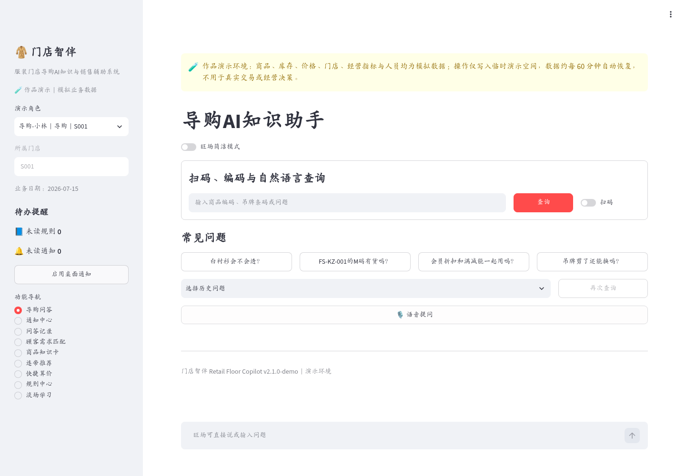
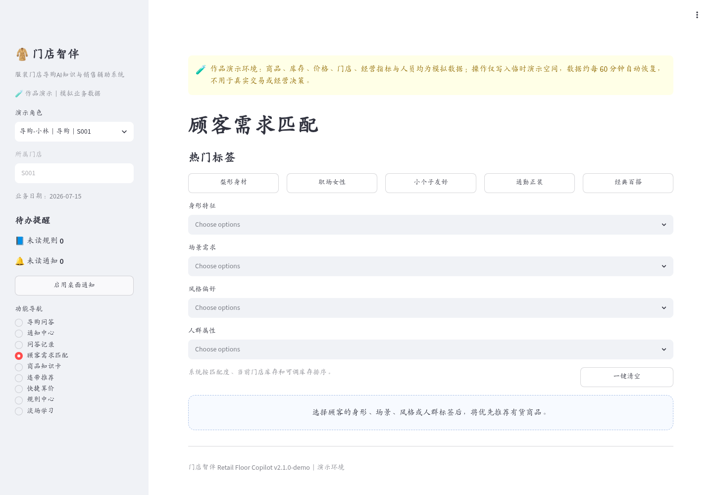
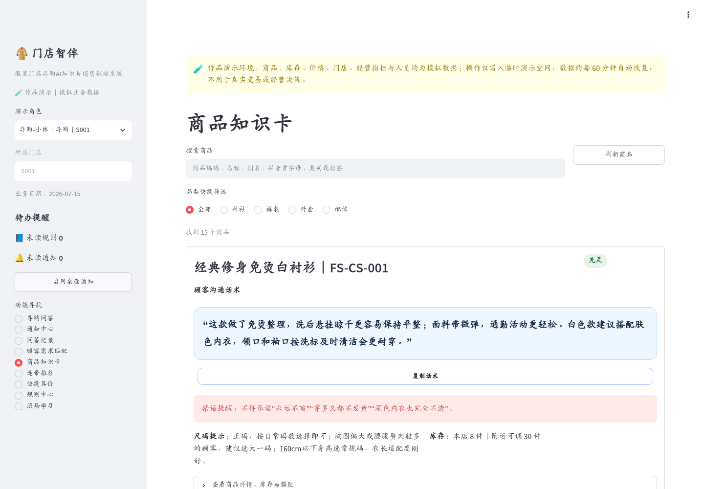
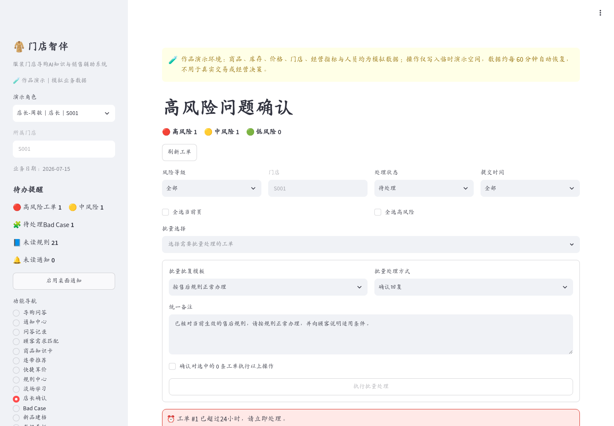
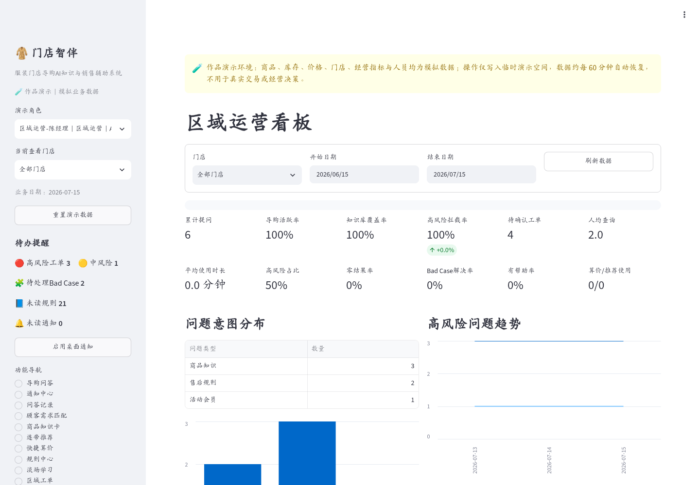
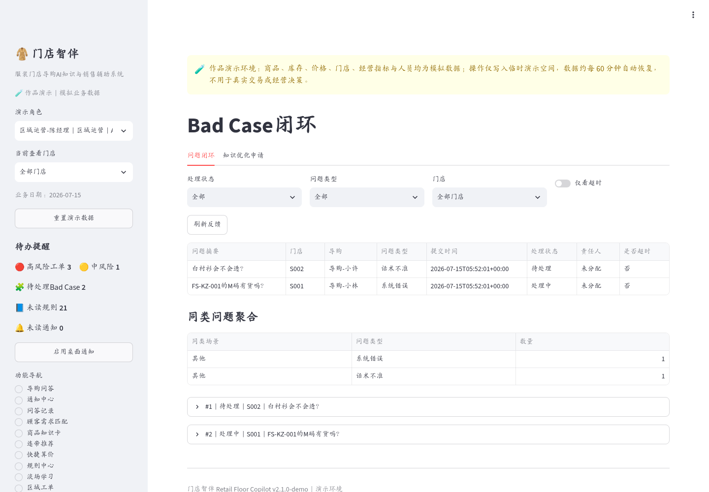
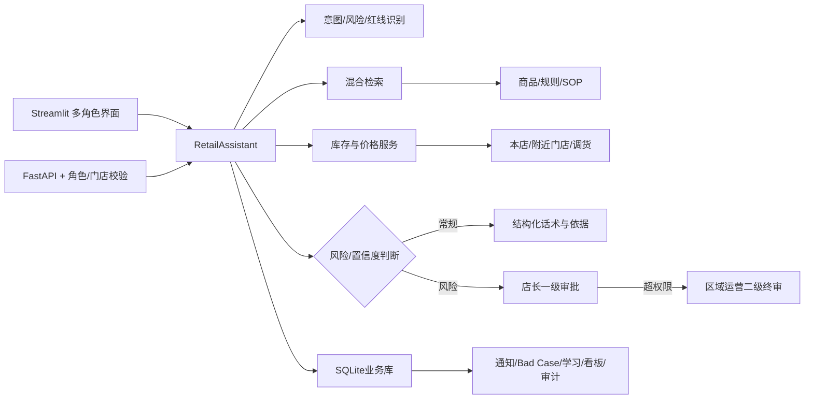

[](https://catalpalog-retail-ai.streamlit.app)


# 门店智伴 Retail Floor Copilot

> 面向服装连锁门店的 AI 导购与运营协同平台，统一承载商品知识查询、库存与调货、顾客需求匹配、连带推荐、活动算价、风险审批、知识治理和区域运营分析。

门店智伴围绕“**一线快速作答、风险人工担责、知识持续治理、过程全程留痕**”组织产品能力。系统将导购现场查询、店长风险确认与区域运营治理连接为一条完整业务链：AI 负责识别、检索和生成候选结果，业务规则负责权限、风险与经营口径控制，店长和区域运营负责高风险场景的最终判断。

## 在线体验

**访问地址：** [https://catalpalog-retail-ai.streamlit.app](https://catalpalog-retail-ai.streamlit.app)

公开环境使用模拟商品、库存、门店、人员和经营数据。进入系统后，可在侧边栏切换导购、店长和区域运营角色，查看不同角色的数据范围与操作权限。运行时数据写入隔离的临时工作区，并按配置周期恢复初始状态。

## 系统界面

<table>
  <tr>
    <td width="50%" valign="top">
      <b>导购 AI 知识助手</b><br/>
      <sub>支持商品编码、吊牌条码、自然语言与语音查询，并集中展示常见问题与最近查询。</sub><br/><br/>
      
    </td>
    <td width="50%" valign="top">
      <b>顾客需求匹配</b><br/>
      <sub>基于场景、风格、身形与人群标签组合顾客需求，并生成可解释的商品匹配结果。</sub><br/><br/>
      
    </td>
  </tr>
  <tr>
    <td width="50%" valign="top">
      <b>商品知识卡</b><br/>
      <sub>集中呈现商品卖点、面料、版型、尺码、顾客话术、禁语与库存相关信息。</sub><br/><br/>
      
    </td>
    <td width="50%" valign="top">
      <b>高风险问题确认</b><br/>
      <sub>店长按风险等级、处理状态、门店范围和时限筛选问题，完成确认、修改、转线下或升级。</sub><br/><br/>
      
    </td>
  </tr>
  <tr>
    <td width="50%" valign="top">
      <b>区域运营看板</b><br/>
      <sub>汇总门店活跃度、知识覆盖、高风险拦截、问题分布与治理动作，为区域运营提供决策依据。</sub><br/><br/>
      
    </td>
    <td width="50%" valign="top">
      <b>Bad Case 闭环</b><br/>
      <sub>聚合高风险问题与人工负反馈，追踪问题分类、责任人、关联商品或规则、优化与复测状态。</sub><br/><br/>
      
    </td>
  </tr>
</table>

> 页面中的商品、库存、价格、人员与经营指标均为公开模拟数据。

## 目录

- [系统界面](#系统界面)
- [系统定位](#系统定位)
- [核心业务闭环](#核心业务闭环)
- [产品角色与权限](#产品角色与权限)
- [核心功能](#核心功能)
- [AI与业务决策机制](#ai与业务决策机制)
- [系统架构](#系统架构)
- [数据与知识资产](#数据与知识资产)
- [评测与验证](#评测与验证)
- [权限与安全](#权限与安全)
- [技术栈](#技术栈)
- [项目结构](#项目结构)
- [本地运行](#本地运行)
- [FastAPI服务](#fastapi服务)
- [Docker运行](#docker运行)
- [Streamlit部署](#streamlit部署)
- [环境变量](#环境变量)
- [测试命令](#测试命令)
- [业务边界](#业务边界)
- [工程文档](#工程文档)
- [License](#license)

---

## 系统定位

门店智伴服务于多门店服装零售组织，解决门店一线知识分散、库存查询链路长、销售话术不统一、高风险问题缺少责任闭环，以及区域运营难以持续治理同类问题等场景。

| 业务对象 | 主要问题 | 系统承载能力 |
|---|---|---|
| 导购 | 商品、库存、活动、搭配与售后口径分散，现场查询耗时 | 扫码、编码、语音和文字统一查询；首屏输出顾客话术、库存状态、依据和风险提醒 |
| 店长 | 重复答疑量大，高风险问题缺少优先级、时限和处理记录 | 风险待办、SLA排序、一级审批、修改话术、转线下和升级区域运营 |
| 区域运营 | 多门店商品与规则口径不一致，同类问题难以聚合治理 | 商品/规则/推荐维护、二级终审、Bad Case分配、知识优化和区域分析 |
| 企业管理 | AI输出、业务规则与人工责任边界不清 | 模型候选结果、规则判断、人工结论与操作日志分层保存 |

### 产品价值

- **查询提效**：减少导购翻资料、跨系统检索和反复询问的时间。
- **销售辅助**：结合顾客标签、库存状态、商品关系和活动规则提供可解释推荐。
- **风险控制**：退款、赔偿、额外折扣、重大客诉和特殊退换等场景进入人工确认。
- **知识治理**：将零结果、答案错误、规则过期和话术不准沉淀为可跟踪的 Bad Case。
- **区域协同**：统一门店问题、规则发布、商品维护、审批与运营分析。
- **过程追溯**：保留问题来源、AI候选答案、审批结论、规则版本和处理记录。

---

## 核心业务闭环

### 1. 导购查询

```text
扫码 / 商品编码 / 语音 / 文字提问
  → 意图与风险识别
  → 商品、规则和SOP检索
  → 库存、价格、活动和推荐补充
  → 输出顾客话术、依据、禁语和下一步动作
  → 导购反馈
```

### 2. 风险审批

```text
高风险问题
  → 店长一级审批
  → 确认回复 / 修改后回复 / 转线下处理
  → 超出门店权限时升级区域运营
  → 区域运营二级终审
  → 最终结论同步导购与原问答记录
```

### 3. Bad Case治理

```text
人工负反馈或高风险问题
  → 问题分类
  → 责任人和处理时限
  → 关联商品、规则或话术
  → 知识优化与版本更新
  → 固定用例复测
  → 效果追踪与关闭
```

### 4. 未识别商品建档

```text
扫描未知吊牌
  → 停止生成未经核验的商品事实
  → 导购提交名称、类别、备注和图片
  → 店长补充面料、版型、卖点、尺码、话术和禁语
  → 区域运营审核编码、价格、版本与生效时间
  → 发布商品卡与条码映射
  → 建立门店和尺码库存档案
  → 等待ERP / POS / WMS同步真实库存
```

### 5. 区域运营分析

```text
提问、会话、风险、零结果、反馈、审批和操作日志
  → 门店指标聚合
  → 区域横向对比
  → 问题定位与治理动作
  → Excel / PNG报表输出
```

---

## 产品角色与权限

| 模块 | 导购 | 店长 | 区域运营 |
|---|---|---|---|
| AI问答、扫码、语音 | 使用 | 使用 | 使用 |
| 问答记录 | 仅本人 | 本门店 | 区域全部门店 |
| 商品知识卡 | 查看 | 查看 | 编辑、批量维护和发布 |
| 本店与附近门店库存 | 查看 | 查看 | 查看 |
| 顾客需求匹配 | 使用 | 使用 | 使用 |
| 连带推荐 | 使用 | 使用 | 使用并维护推荐关系 |
| 快捷算价 | 使用 | 使用 | 使用 |
| 规则中心 | 查看当前版本 | 查看当前版本 | 发布、版本和差异管理 |
| 高风险审批 | 不可操作 | 本门店一级审批 | 区域二级终审 |
| Bad Case | 提交反馈 | 本门店处理与优化申请 | 区域分配、优化、复测和关闭 |
| 新品建档 | 提交基础信息 | 补充资料并送审 | 终审与发布 |
| 数据看板 | 个人成长 | 本店数据与区域均值 | 区域对比与门店排名 |
| 操作日志 | 不可见 | 不可见 | 查看区域操作记录 |

### 数据范围原则

- 导购仅访问本人问答、通知、反馈和学习记录。
- 店长访问所属门店的问答、工单、Bad Case、新品申请和经营指标。
- 区域运营访问所属区域内全部门店，并维护商品、规则、推荐和治理配置。
- 页面可见性与 API 接口权限分别校验，前端隐藏不替代服务端鉴权。

---

## 核心功能

### 导购工作台

- 商品编码、吊牌条码、商品名称、别名、拼音和首字母查询。
- 摄像头扫码、中文语音和文字自然语言提问。
- 旺场简洁模式优先展示顾客话术、库存状态、禁语和下一步动作。
- 最近查询快捷复用与高频问题快捷触发。
- 商品卖点、尺码和库存优先展示，面料与搭配信息按需展开。
- 本店分尺码库存、附近门店库存、调货时效和价格参考。
- 顾客标签按身形、场景、风格和人群组织，推荐结果按匹配度与库存排序。
- 连带推荐展示搭配理由、库存与调货口径，并可加入算价清单。
- 快捷算价自动加载当前生效活动，拆解优惠明细并给出凑单提示。
- 规则更新提醒、版本差异、风险标签、淡场学习和个人成长记录。

### 高风险问题确认

- 高、中、低风险待办分层展示。
- 高风险、升级工单、2小时加急和24小时超时任务优先排序。
- 工单保留原问题、AI候选答案、标准话术、风险依据和规则来源。
- 支持待处理、处理中、已完成和已驳回状态筛选。
- 店长可确认回复、修改后回复、转线下处理或升级区域运营。
- 区域运营对跨店、超权限和升级工单进行二级终审。
- 支持批量选择、批量模板、二次确认和批量分派。
- 审批结果同步导购通知与原问答记录。

### Bad Case治理

- 高风险问题和人工负反馈进入风险与知识复盘池。
- 支持知识缺失、答案错误、边界模糊、话术不准、来源不匹配、规则过期、诱导违规和系统错误分类。
- 记录责任人、处理期限、超时提醒、图片凭证和处理动作。
- 保存原问题、AI原回答、导购反馈、关联商品/规则、版本和复测结果。
- 聚合同类问题并统计知识优化后的重复发生情况。
- 店长提交知识优化申请，区域运营分配、处理和关闭。

### 商品、规则与推荐运营

- 商品知识卡单条编辑与批量维护。
- 新品申请补全、终审和发布。
- 固定连带推荐关系与动态标签推荐并行。
- 规则统一发布、版本管理、已读提醒和差异对比。
- 未识别商品不生成未经核验的卖点、价格或库存承诺。
- 新品发布后写入商品知识、条码映射与各门店零库存档案。

### 数据看板

- 累计提问、导购活跃率、人均查询、平均使用时长与环比。
- 知识覆盖率、高风险拦截率、零结果率、有帮助率和 Bad Case解决率。
- 高频问题、零结果问题、意图分布与高风险趋势。
- 按门店和导购拆分高风险问题。
- 门店横向对比、综合得分和区域排名。
- 快捷算价、连带推荐和淡场学习使用分析。
- 规则、商品和 Bad Case治理动作效果追踪。
- Excel与PNG报表导出。

---

## AI与业务决策机制

系统将回答过程拆分为三个相互独立的决策层：

| 决策层 | 负责内容 | 约束边界 |
|---|---|---|
| AI与检索层 | 意图识别、风险识别、资料检索、候选话术和来源排序 | 不直接决定退款、赔偿、额外折扣和重大客诉处理 |
| 业务规则层 | 角色权限、门店范围、库存口径、活动条件、禁语、SLA与升级门槛 | 不替代需要业务责任人判断的边界场景 |
| 人工决策层 | 高风险确认、话术修改、线下转交、升级和最终结论 | 不覆盖模型原始输出和历史依据，保留完整责任链 |

当未配置大模型密钥时，系统仍可通过检索结果与规则模板生成结构化兜底回答；配置兼容 OpenAI 协议的模型服务后，可在规则边界内启用生成式回答。

---

## 系统架构



### 架构说明

| 层级 | 组件 | 职责 |
|---|---|---|
| 交互层 | Streamlit | 多角色工作台、扫码、语音、问答、审批、看板和配置页面 |
| API层 | FastAPI | 对外接口、参数校验、用户识别、角色与门店范围校验 |
| 业务编排层 | RetailAssistant | 串联意图、风险、检索、库存、规则、推荐与回答生成 |
| 检索与规则层 | Retrieval / Risk / Catalog | 商品、规则、SOP混合检索，风险与红线判断，商品知识管理 |
| 经营服务层 | Inventory / Promotion | 本店库存、附近门店库存、调货、价格和活动算价 |
| 工作流层 | SQLite业务库 | 问答、通知、审批、Bad Case、新品、学习、看板和审计记录 |
| 模型适配层 | OpenAI兼容接口 | 可选生成模型接入；无密钥时使用规则模板兜底 |
| 企业集成层 | ERP / POS / WMS / SSO | 正式环境中的实时库存、价格、会员、身份与组织数据接入 |

### 请求处理链

```text
用户问题
  → 文本规范化
  → 意图、风险和红线识别
  → 商品 / 规则 / SOP混合检索
  → 库存、活动和推荐补充
  → 规则模板或可选LLM生成
  → 结构化话术、来源和风险提示
  → 自动返回或人工审批
  → 反馈、Bad Case与运营指标沉淀
```

---

## 数据与知识资产

仓库内置以下公开样例资产：

| 数据资产 | 数量 | 主要用途 |
|---|---:|---|
| 商品知识卡 | 15 | 商品卖点、面料、版型、尺码、话术和禁语 |
| 条码映射 | 15 | 吊牌扫码与商品定位 |
| 分门店分尺码库存 | 183 | 本店库存、附近门店库存与调货判断 |
| 固定连带推荐关系 | 45 | 可解释搭配和连带推荐 |
| 顾客标签 | 16 | 身形、场景、风格与人群匹配 |
| 规则与知识章节 | 24 | 活动、售后、服务和门店制度检索 |
| 高频与困难问题 | 289 | 快捷提问、淡场学习和知识覆盖分析 |
| 固定评测用例 | 85 | 意图、风险、来源命中与安全处理评测 |
| 研究发现记录 | 10 | 需求、产品规则与设计决策依据 |
| 促销活动 | 2 | 快捷算价与活动条件计算 |

公开数据均为模拟或整理后的样例资料，不代表真实门店、商品或经营情况。

---

## 评测与验证

固定评测结果来自 `artifacts/eval_report.json`：

| 指标 | 结果 |
|---|---:|
| 评测用例数 | 85 |
| 意图识别准确率 | 97.65% |
| 风险识别准确率 | 100% |
| 高风险召回率 | 100% |
| 来源命中率@3 | 98.82% |
| 安全处理准确率 | 100% |

自动验证记录包括：

- Python代码编译通过。
- Pytest共32项测试通过。
- Streamlit AppTest无未处理异常。
- 临时数据初始化、自动恢复和手动重置通过。
- 固定评测集可重复执行并生成明细结果。

评测产物：

- `artifacts/eval_report.json`
- `artifacts/eval_details.csv`
- `artifacts/verification_report.md`

上述结果基于仓库内固定测试集和模拟资料，用于验证当前规则、检索、权限与回答链路，不等同于真实门店上线效果。

---

## 权限与安全

### 当前实现

- Streamlit根据角色展示页面和操作入口。
- FastAPI通过 `X-User-Id` 识别当前用户，并在接口层校验角色、门店和区域数据范围。
- 店长不能读取其他门店的管理数据。
- 导购不能调用店长和区域运营管理接口。
- 区域运营独占商品、推荐、规则发布和审计权限。
- 可配置 `X-Demo-Token` 保护单独公开的 FastAPI 服务。
- API密钥从环境变量或 Streamlit Secrets 读取，不写入代码仓库。
- 公开环境在临时目录创建 SQLite 运行库，不改写仓库中的基础资料。

### 正式环境接入要求

- 使用企业 OIDC / SSO 完成身份认证与离职账号回收。
- 由组织和门店主数据决定角色及数据范围，不信任客户端传入的角色。
- 使用 PostgreSQL 或 MySQL 持久化业务数据，并配置备份与恢复。
- 图片凭证迁移到对象存储，并配置访问控制和生命周期策略。
- 接入 HTTPS、限流、日志脱敏、监控、告警和审计留存。
- ERP、POS、WMS、会员与活动数据由企业接口提供并校验更新时间。

---

## 技术栈

| 层级 | 技术 |
|---|---|
| Web交互 | Streamlit |
| API服务 | FastAPI、Uvicorn、Pydantic |
| 业务编排 | Python领域服务与工作流逻辑 |
| 检索与排序 | pandas、scikit-learn、规则匹配 |
| 扫码与语音 | zxing-cpp、Pillow、streamlit-mic-recorder |
| 数据存储 | CSV、SQLite |
| 大模型适配 | OpenAI兼容接口，可选启用 |
| 测试与评测 | Pytest、固定评测集、GitHub Actions |
| 部署 | Streamlit Community Cloud、Docker Compose |

---

## 项目结构

```text
retail-floor-copilot/
├─ app/
│  ├─ api.py                    # FastAPI接口与数据范围校验
│  ├─ assistant.py              # RetailAssistant业务编排
│  ├─ catalog.py                # 商品与条码服务
│  ├─ config.py                 # 环境、运行目录与模型配置
│  ├─ db.py                     # SQLite模型、工作流与统计
│  ├─ inventory.py              # 库存、价格、调货与活动服务
│  ├─ llm.py                    # OpenAI兼容模型适配
│  ├─ retrieval.py              # 商品、规则与SOP混合检索
│  ├─ risk.py                   # 风险、红线和审批判断
│  └─ schemas.py                # API数据模型
├─ ui/
│  └─ streamlit_app.py          # 完整多角色Streamlit界面
├─ data/                        # 商品、库存、规则、推荐、问题与评测数据
├─ docs/                        # PRD、研究、信息架构、评测、运维与部署文档
├─ tests/                       # API、权限、检索、库存、风险和闭环测试
├─ scripts/
│  ├─ init_db.py                # 初始化SQLite业务库
│  └─ run_eval.py               # 执行固定评测
├─ artifacts/                   # 评测报告与验证结果
├─ .streamlit/                  # Streamlit配置与Secrets模板
├─ streamlit_app.py             # Community Cloud根目录入口
├─ Dockerfile.api               # FastAPI镜像
├─ Dockerfile.web               # Streamlit镜像
├─ docker-compose.yml           # API与Web容器编排
├─ requirements.txt             # Python依赖
├─ pyproject.toml               # 项目元数据与测试配置
└─ README.md
```

---

## 本地运行

### 环境要求

- Python 3.10+
- Windows、macOS或Linux

### 1. 创建虚拟环境

```bash
python -m venv .venv
```

Windows：

```powershell
.\.venv\Scripts\Activate.ps1
```

macOS / Linux：

```bash
source .venv/bin/activate
```

### 2. 安装依赖

```bash
python -m pip install --upgrade pip
python -m pip install -r requirements.txt
```

### 3. 初始化数据

```bash
python scripts/init_db.py
```

### 4. 启动Web应用

```bash
python -m streamlit run streamlit_app.py
```

浏览器访问：

```text
http://localhost:8501
```

摄像头、麦克风和桌面通知需要浏览器授权。语音识别受浏览器与网络环境影响，不可用时可以继续使用文字查询。

---

## FastAPI服务

启动接口服务：

```bash
python -m uvicorn app.api:app --reload --host 0.0.0.0 --port 8000
```

接口文档：

```text
http://localhost:8000/docs
```

管理接口请求头示例：

```text
X-User-Id: 2
X-Demo-Token: your-token
```

`X-Demo-Token` 仅在配置 `API_DEMO_TOKEN` 时必填。

---

## Docker运行

在项目根目录创建本地 `.env`：

```bash
cp .env.example .env
```

Windows PowerShell：

```powershell
Copy-Item .env.example .env
```

构建并启动：

```bash
docker compose up --build
```

访问地址：

```text
Streamlit: http://localhost:8501
FastAPI:   http://localhost:8000/docs
```

停止服务：

```bash
docker compose down
```

---

## Streamlit部署

Community Cloud部署参数：

| 配置项 | 内容 |
|---|---|
| Repository | GitHub中的项目仓库 |
| Branch | `main` |
| Main file path | `streamlit_app.py` |
| Python | `3.11` |

推荐在应用 Secrets 中配置：

```toml
APP_MODE = "demo"
AUTH_MODE = "demo"
DEMO_RESET_MINUTES = 60
DEMO_SHOW_ROLE_SWITCHER = true
DEMO_ALLOW_CATALOG_WRITES = false
SIMULATED_INVENTORY = true
DEMO_ACCESS_CODE = ""
API_DEMO_TOKEN = ""
LLM_API_KEY = ""
LLM_BASE_URL = "https://api.openai.com/v1"
LLM_MODEL = "gpt-4.1-mini"
RFC_BUSINESS_DATE = "2026-07-15"
RFC_TOP_K = 5
RFC_MIN_SCORE = 0.055
```

部署前确认以下文件未提交到Git：

```text
.env
.streamlit/secrets.toml
*.db
上传图片
运行日志
```

完整部署说明见：[`docs/09_Deployment_Demo.md`](docs/09_Deployment_Demo.md)。

---

## 环境变量

| 变量 | 默认值 | 说明 |
|---|---|---|
| `APP_MODE` | `demo` | `demo`使用隔离临时目录；其他模式读取指定数据目录 |
| `AUTH_MODE` | `demo` | `demo`使用角色选择器；`oidc`使用Streamlit身份认证 |
| `DEMO_RESET_MINUTES` | `60` | 临时数据自动恢复周期 |
| `DEMO_SHOW_ROLE_SWITCHER` | `true` | 是否显示角色切换入口 |
| `DEMO_ALLOW_CATALOG_WRITES` | `true` | 是否允许修改商品、规则和推荐配置 |
| `SIMULATED_INVENTORY` | `true` | 是否显示模拟库存标识 |
| `DEMO_ACCESS_CODE` | 空 | 公开环境的可选访问口令 |
| `API_DEMO_TOKEN` | 空 | FastAPI可选访问令牌 |
| `RFC_BUSINESS_DATE` | `2026-07-15` | 活动、规则和报表使用的业务日期 |
| `RFC_TOP_K` | `5` | 混合检索返回数量 |
| `RFC_MIN_SCORE` | `0.055` | 检索最低分阈值 |
| `LLM_API_KEY` | 空 | OpenAI兼容模型服务密钥 |
| `LLM_BASE_URL` | OpenAI接口地址 | 模型服务基础URL |
| `LLM_MODEL` | `gpt-4.1-mini` | 模型名称 |
| `LLM_TIMEOUT_SECONDS` | `30` | 模型请求超时时间 |

本地环境变量参考：`.env.example`  
Streamlit Secrets参考：`.streamlit/secrets.toml.example`

---

## 测试命令

运行全部测试：

```bash
python -m pytest -q
```

运行固定评测：

```bash
python scripts/run_eval.py
```

评测输出：

```text
artifacts/eval_report.json
artifacts/eval_details.csv
```

---

## 业务边界

- `inventory.csv` 是库存、价格和调货的数据适配层，正式环境应替换为 ERP、POS 或 WMS 接口。
- 未识别商品不会自动生成卖点、价格、库存或调货承诺。
- 退款、赔偿、优惠叠加、跨店争议和重大客诉必须进入人工审批。
- 快捷算价为参考结果，最终以收银系统、会员账户、券码和实时活动校验为准。
- 商品推荐用于销售辅助，不代表顾客必须购买，也不替代导购的现场判断。
- 门店制度、员工管理规则和顾客承诺口径应经过业务、法务和人力部门审核后发布。
- 固定评测结果仅反映当前样例数据和测试集表现，不代表真实生产环境效果。

---

## 工程文档

| 文档 | 内容 |
|---|---|
| [`docs/01_PRD.md`](docs/01_PRD.md) | 产品需求、角色、流程、功能和验收范围 |
| [`docs/02_User_Research.md`](docs/02_User_Research.md) | 用户研究、访谈框架与研究结论 |
| [`docs/03_Information_Architecture.md`](docs/03_Information_Architecture.md) | 信息架构、导航和角色页面范围 |
| [`docs/04_Evaluation_Plan.md`](docs/04_Evaluation_Plan.md) | 意图、风险、检索与安全评测设计 |
| [`docs/05_Product_Overview.md`](docs/05_Product_Overview.md) | 产品定位、价值、业务链路和数据规模 |
| [`docs/06_Data_Dictionary.md`](docs/06_Data_Dictionary.md) | 核心数据表、字段和业务口径 |
| [`docs/07_Operations_Manual.md`](docs/07_Operations_Manual.md) | 门店和区域运营流程 |
| [`docs/08_Acceptance_Checklist.md`](docs/08_Acceptance_Checklist.md) | 功能、权限、数据和部署验收项 |
| [`docs/09_Deployment_Demo.md`](docs/09_Deployment_Demo.md) | Streamlit部署、Secrets和运行策略 |

---

## License

项目使用 [MIT License](LICENSE)。第三方组件和参考项目见 [THIRD_PARTY_NOTICES.md](THIRD_PARTY_NOTICES.md)。
